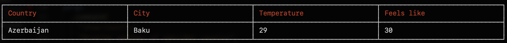
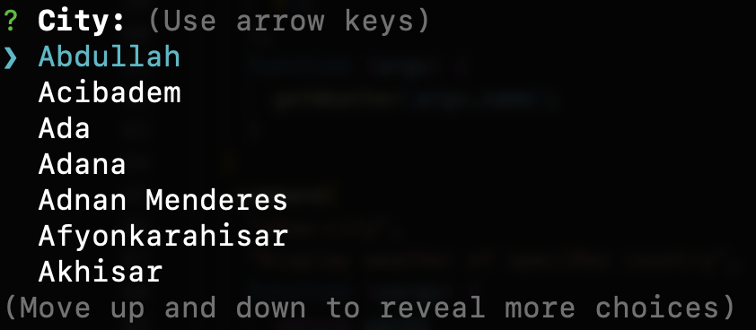
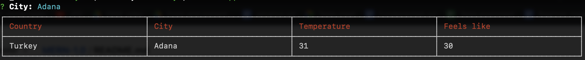

## Weather App with NodeJS and REST API

### Packages 📦

Here is a list of all the packages you will need to create this app:

* [Yargs' API](https://github.com/yargs/yargs)
* [cli-table](https://www.npmjs.com/package/cli-table)
* [inquirer](https://www.npmjs.com/package/inquirer)
* [axios](https://www.npmjs.com/package/axios)

---

### Task 🎯

Create **cli commands** that will show the weather of any *country* or *city*.<br/>The program must display a table with these data: **Country**, **City**, **Temperature**, **feels like**

<br/>

1. This command must show the weather of the country that we specified in **--name**. The city must be the capital of the specified country.

```
node app show-country --name Azerbaijan
```



2. This command must show the list of cities that we specified in **--country**:

```
node app show-city --country Turkey
```


Once we select a city, the program muts show us a similar table.



---
**Note**❗: Temperature is shown in **Celsius** by default. By adding **-f** at the end of any command, program must show us temperature in **farenheit**.
